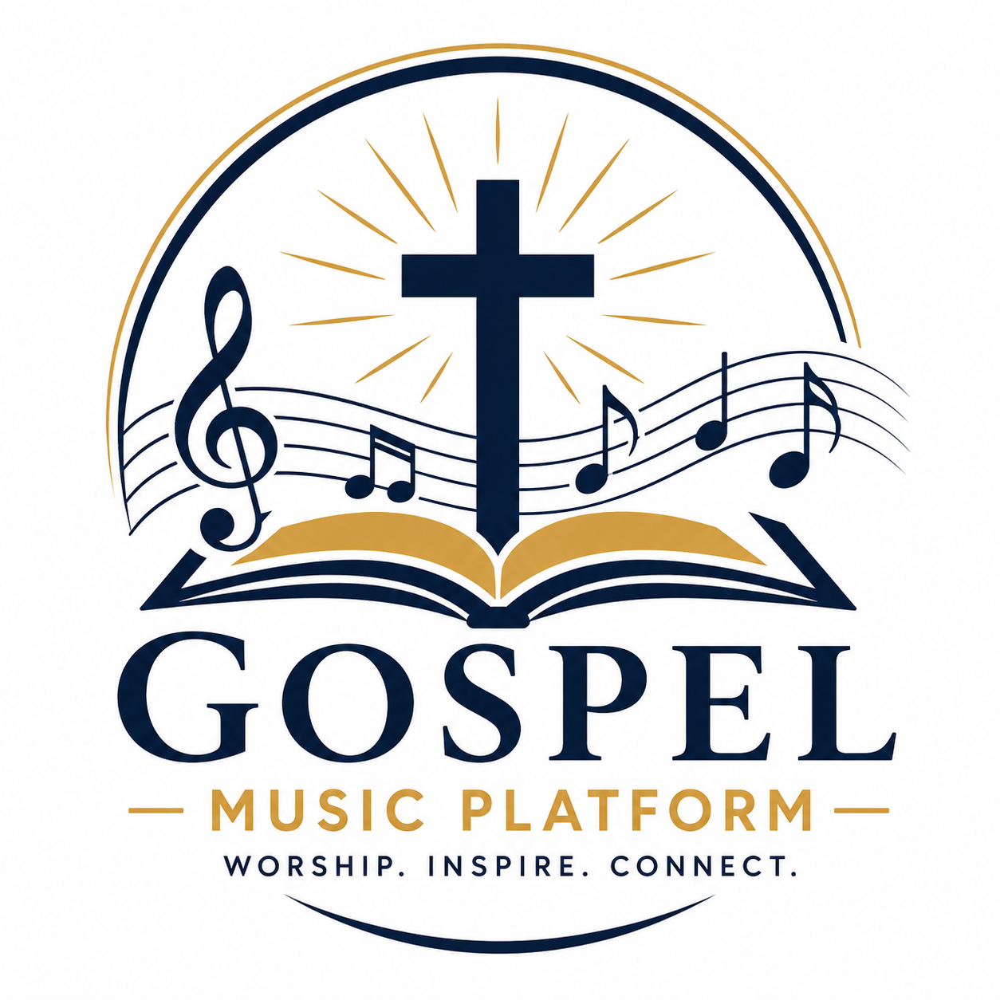

  

# Gospel Music Platform
>A responsive gospel music website built with HTML and CSS to share gospel songs, worship events, and provide a contact platform for users.

## The Problem
Many gospel ministries and worship communities lack simple and affordable online platforms to share gospel music, announce worship events, and communicate with followers. This limits access to inspirational content and event information for people outside physical gatherings.

## Target Audience
- Gospel music lovers
- Christian worship communities
- The Youth
- Choir members
- Online ministry followers
  
## The Core Pillars
- Spreading the Gospel through music
- Promoting worship and community events
- Providing a simple and user-friendly experience
- Encouraging communication and engagement

## Built With
 **Fronted:** HTML5 and CSS3

## Features
- Responsive homepage
- Gospel songs section
- Upcoming events section
- Contact form
